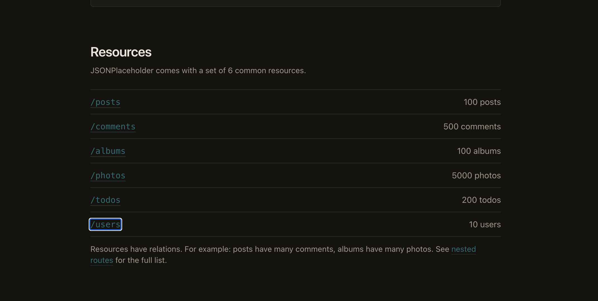
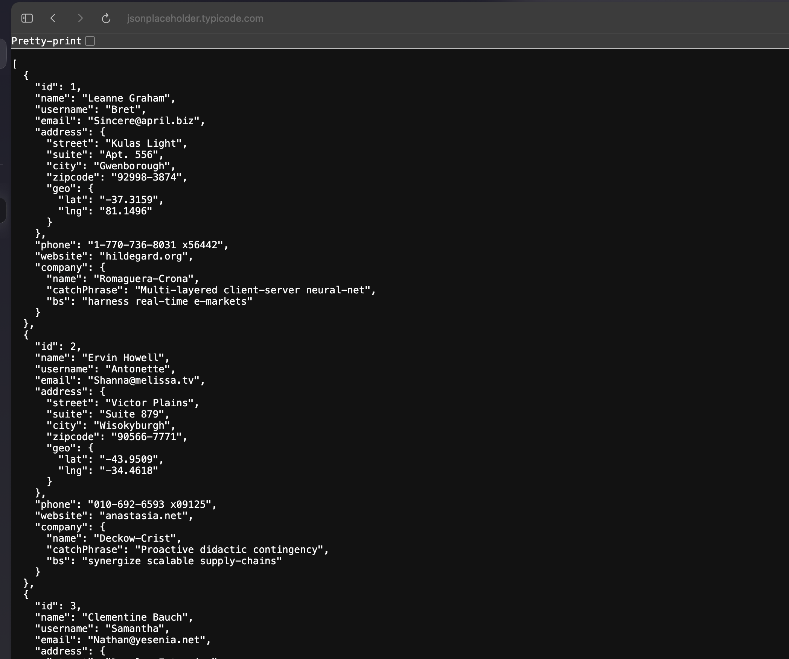
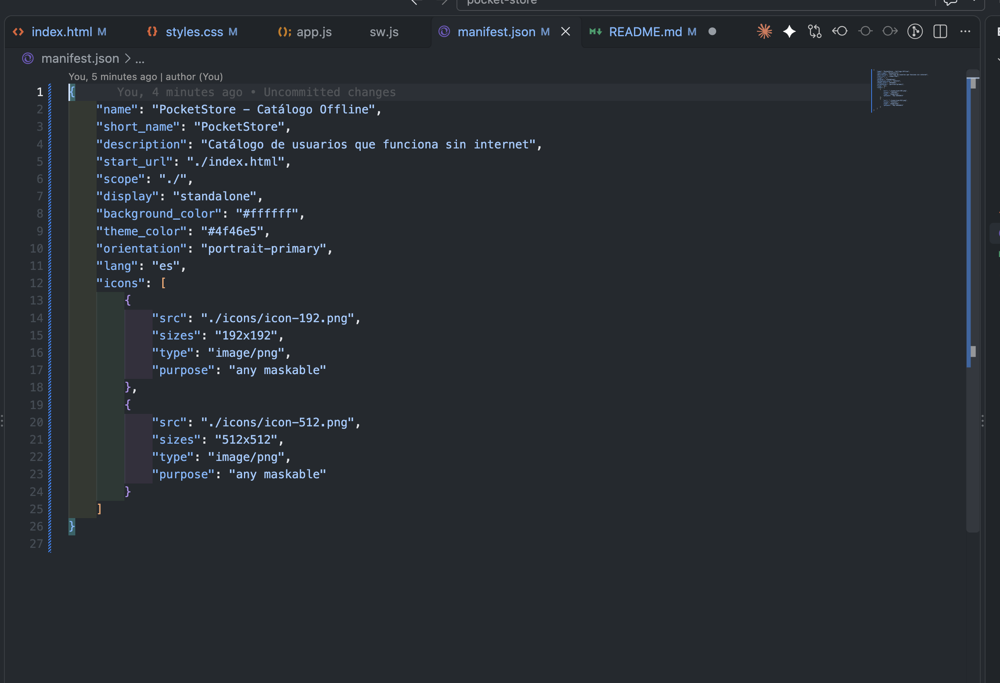
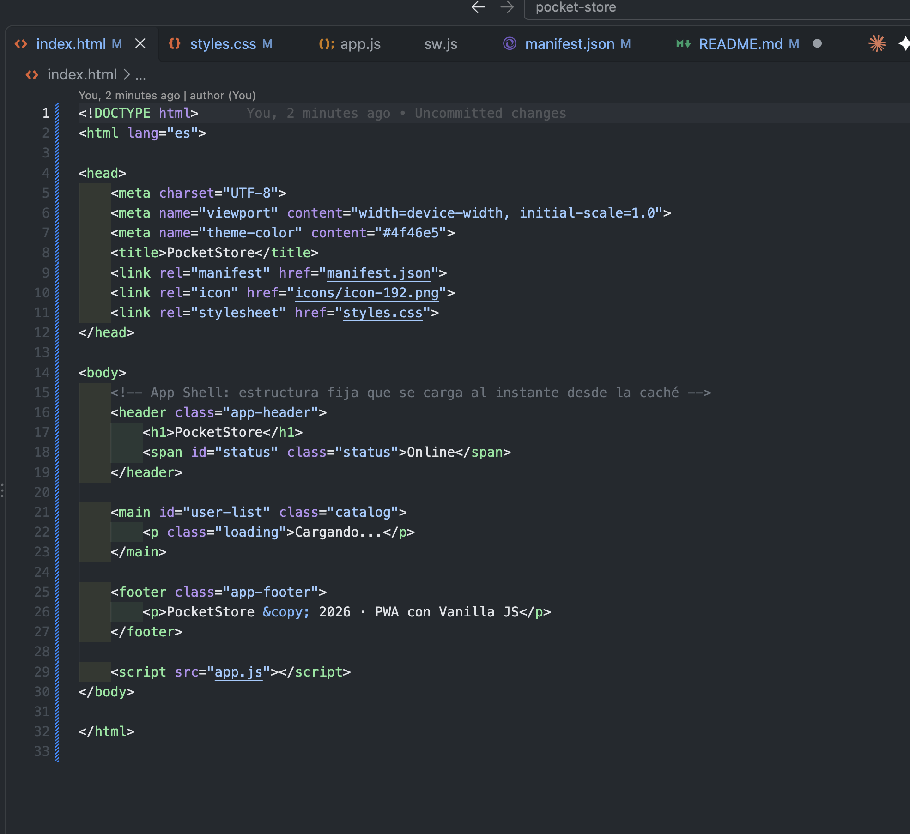
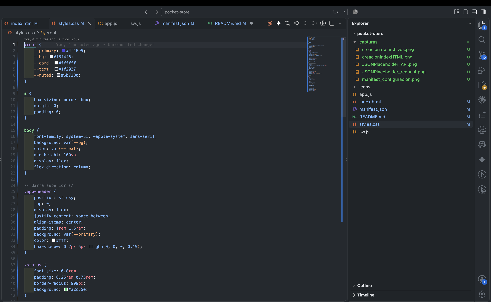
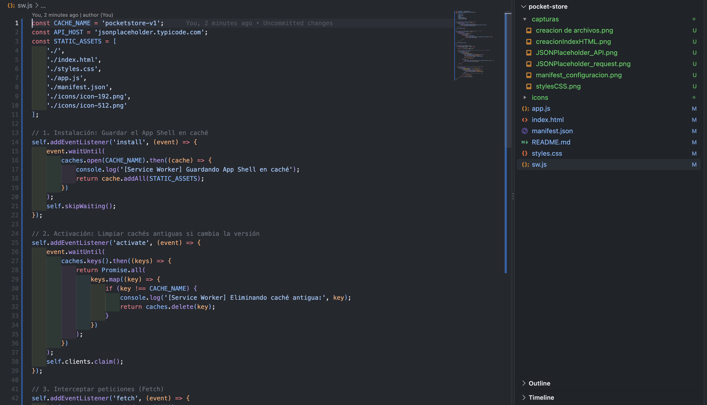
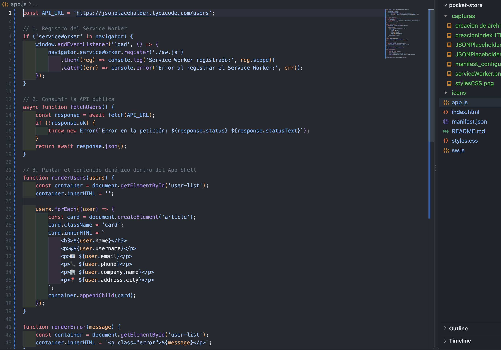
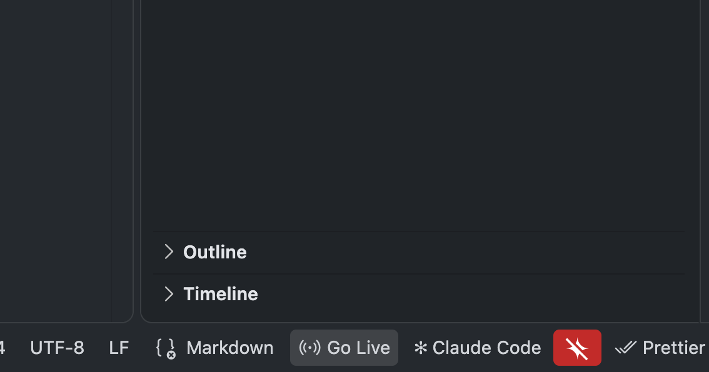
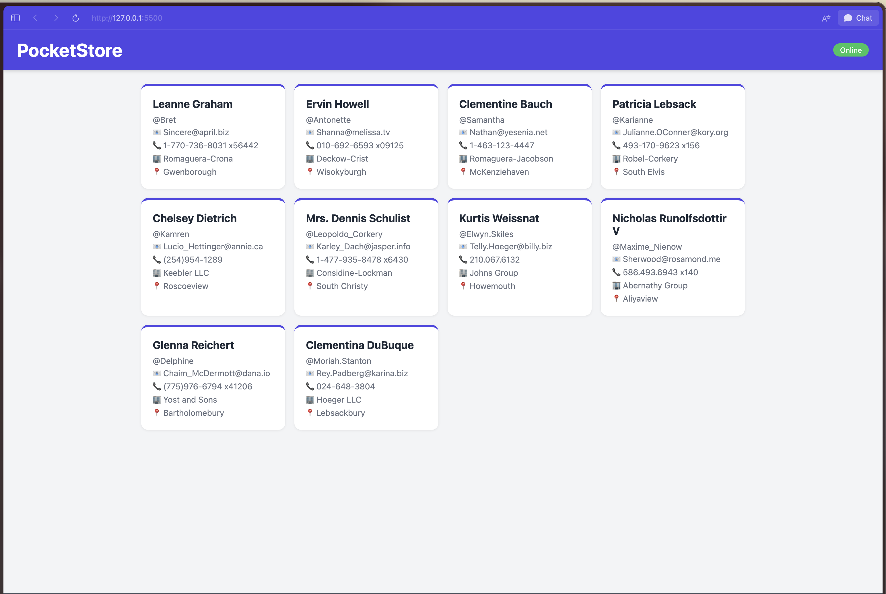
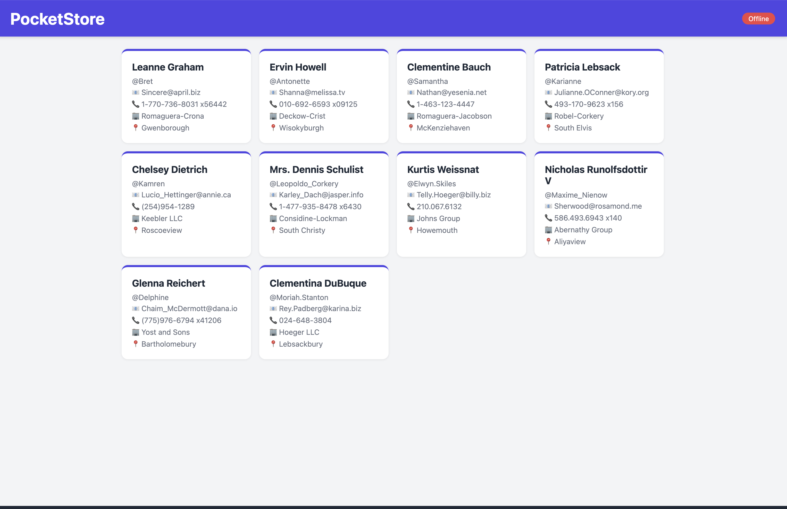

# Documentacion del proceso de desarrollo del proyecto

## Creacion de primeros archivos del proyecto

## Busqueda de una API en JSONPlaceholder
Se utilizara la API de /users

Reponse de la API

## Configuracion del manifest.json
Se creó manifest.json con el nombre, nombre corto, start_url, modo standalone, colores corporativos (#4f46e5) y dos iconos (192x192 y 512x512) para permitir instalar la aplicación.

## App Shell
Se diseñó la estructura estática (barra superior, contenedor principal y pie de página) en index.html y styles.css. Esta "Vista" carga al instante mientras el contenido dinámico llega después desde la API.

index.html:

styles.css:

## Creacion del Service Worker y Caché
En sw.js se programó el ciclo de vida del Service Worker. En install se guarda el App Shell en caché, en activate se borran las cachés antiguas y en fetch se usa Network First para la API (datos actualizados, o la caché si no hay red) y Cache First para los archivos estáticos.

## Contenido dinámico
 En app.js se registra el Service Worker y se consume la API https://jsonplaceholder.typicode.com/users con fetch(). Los usuarios se muestran como tarjetas dentro del App Shell, junto a un indicador de conexión Online/Offline.

 ## Probamos el proyecto
 Levantamos el servicio para cargar la aplicacion:

### Resultado en el navegador con conexion:
 

### Resuktado del navegador al estar offline
 

